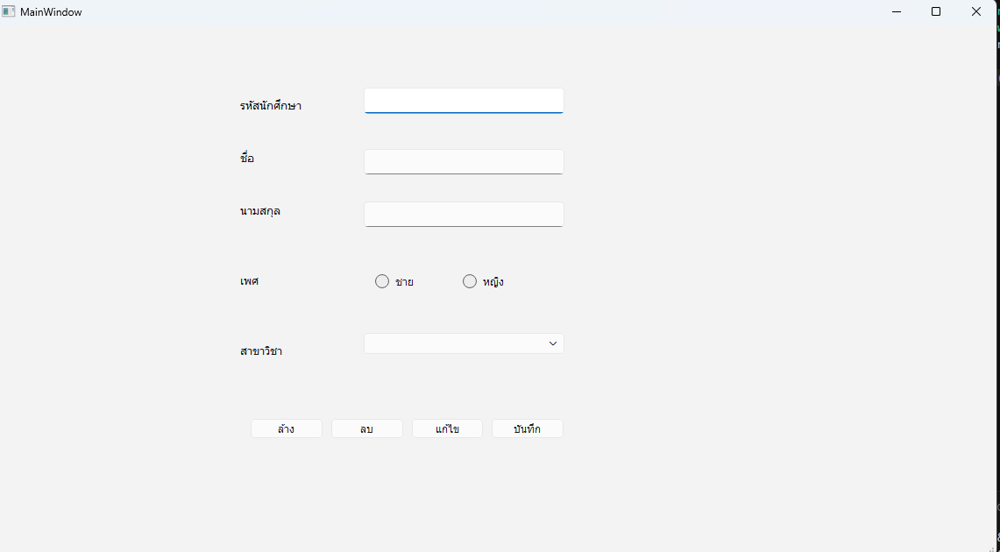

# 🧑‍🎓 ระบบลงทะเบียนข้อมูลนักศึกษา (Student Registration System)

โปรเจกต์นี้เป็นส่วนหนึ่งของการฝึกพัฒนา GUI ด้วย **PySide6** (Qt for Python)  
วัตถุประสงค์เพื่อสร้างฟอร์มสำหรับบันทึกข้อมูลนักศึกษาในมหาวิทยาลัย โดยผู้ใช้สามารถกรอกข้อมูล และบันทึก/แก้ไข/ลบผ่านหน้าจอ

---

## 📌 ฟีเจอร์หลัก (Features)

- ✅ รับข้อมูลนักศึกษา:
  - รหัสนักศึกษา (`student_id`)
  - ชื่อ (`firstname`)
  - นามสกุล (`lastname`)
  - เพศ (`sex` : ชาย/หญิง)
  - สาขาวิชา (`major` : เลือกจาก Dropdown)
- ✅ ปุ่มควบคุม:
  - **ล้าง** ฟอร์ม
  - **บันทึก** ข้อมูล
  - **แก้ไข** ข้อมูล
  - **ลบ** ข้อมูล
  - (ปุ่มเพิ่มเติมสามารถเชื่อมต่อกับฐานข้อมูลหรือไฟล์ JSON ได้ในภายหลัง)

---

## 🖼️ ภาพรวม UI

| Component        | ตำแหน่งโดยประมาณ | คำอธิบาย |
|----------------|----------------|-----------|
| ช่องรหัสนักศึกษา | x=420, y=70     | QLineEdit |
| ช่องชื่อ         | x=420, y=140    | QLineEdit |
| ช่องนามสกุล     | x=420, y=200    | QLineEdit |
| RadioButton เพศ | x=430, y=280 (ชาย), x=530, y=280 (หญิง) | QRadioButton |
| ComboBox สาขา   | x=420, y=350    | Dropdown (สามารถเพิ่มรายการได้ในโค้ด) |
| ปุ่มควบคุม       | x=290, y=440    | 4 ปุ่มแนวนอน : ล้าง, บันทึก, แก้ไข, ลบ |

> ℹ️ ขนาดหน้าต่างเริ่มต้น: `1143x606`

---

## 🧰 เทคโนโลยีที่ใช้

- **Python** 3.x
- **PySide6** (Qt for Python) – สร้าง GUI
- **Qt Designer** (`.ui`) – ออกแบบ UI แล้วแปลงเป็น Python

---

## 📂 โครงสร้างไฟล์ (ตัวอย่าง)
project/
├── form_student_univercity.ui # ไฟล์ต้นฉบับจาก Qt Designer
├── mystudent.py # ไฟล์ Ui_MainWindow ที่แปลงจาก .ui
├── main.py # ตัวเรียกใช้งานหลัก (รวมอยู่ในไฟล์นี้)
└── README.md # เอกสารอธิบายโปรเจกต์

> **หมายเหตุ:** โค้ดที่ให้มาในคำขอของคุณเป็นโค้ดที่แปลงจาก `.ui` และมีส่วน `if __name__ == "__main__"` สำหรับรัน GUI ได้ทันที

---

## 🚀 วิธีรันโปรแกรม

1. ติดตั้ง PySide6 (ถ้ายังไม่มี):
   ```bash
   pip install PySide6
2 บันทึกโค้ดที่ได้ลงในไฟล์ mystudent.py

3 รันโปรแกรม:
python mystudent.py
4 หน้าต่างฟอร์มจะแสดงขึ้นมา พร้อมให้กรอกข้อมูลตามที่ออกแบบ

## 🖼️ หน้าตาโปรแกรม

